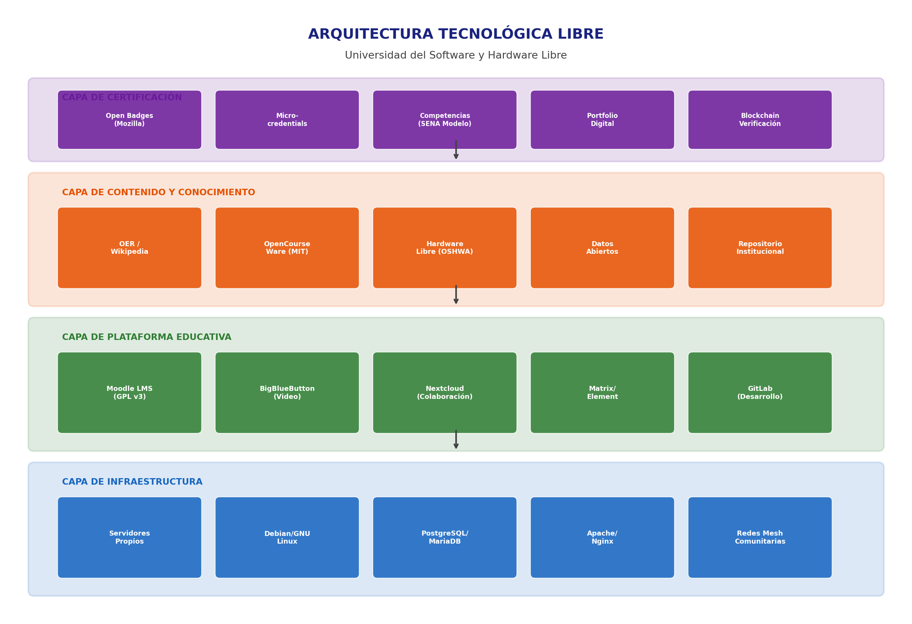
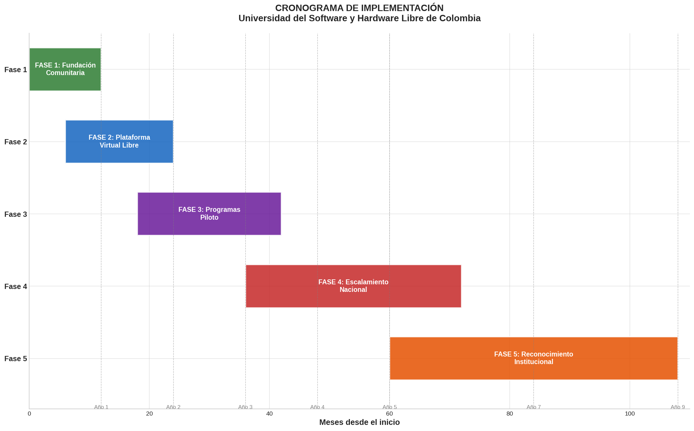

# Universidad del Software y Hardware Libre de Colombia

> **"Universidad Libre de Conocimiento, Tecnologia y Soberania Digital"**

---

## Resumen Ejecutivo

Este repositorio documenta el proyecto estrategico para crear en Colombia una
universidad publica virtual basada en software libre, hardware libre, datos
abiertos, conocimiento abierto (OER) y soberania tecnologica.

El proyecto propone un modelo educativo alternativo sin carreras tecnicas ni
profesionales convencionales, donde cualquier persona de cualquier edad puede
usar, estudiar, compartir y mejorar el conocimiento tecnologico.

| Campo | Valor |
|---|---|
| **Fecha de creacion del proyecto** | 04/07/2026 |
| **Fecha de publicacion en GitHub** | 04/07/2026 |
| **Numero de radicacion DNDA** | 1-2026-130068 |
| **Autor** | WILLIAM ENRIQUE PADILLA VIVERO |
| **Documento de identidad** | 72268263 |
| **Pais** | Colombia |
| **Duracion del plan** | 9 anos (2026-2035) |
| **Fases** | 5 (Fundacion -> Plataforma -> Pilotos -> Escalamiento -> Institucional) |
| **Modalidad inicial** | 100% virtual |
| **Modalidad futura** | Campus descentralizados |
| **Infraestructura** | Cero dependencia de plataformas propietarias |
| **Certificacion** | Por competencias (Open Badges, modelo SENA) |

---

## Documentos del Proyecto

| Documento | Descripcion |
|---|---|
| [Plan estrategico completo](docs/plan-estrategico-completo.pdf) | Documento PDF con todo el plan de 9 anos |
| [Fundamentacion filosofica](docs/fundamentacion-filosofica.md) | 5 pilares, vision, diferenciacion con el sistema tradicional |
| [Modelo educativo](docs/modelo-educativo.md) | Rutas de aprendizaje, certificacion por competencias |
| [Infraestructura tecnologica](docs/infraestructura-tecnologica.md) | Arquitectura de 4 capas, herramientas libres |
| [Plan de implementacion](docs/plan-implementacion.md) | 5 fases, cronograma, metas por fase |
| [Financiacion](docs/financiacion.md) | Costos, fuentes de ingreso, sostenibilidad |
| [Gobernanza y comunidad](docs/gobernanza.md) | Modelo participativo, construccion de comunidad |

---

## Licencia

Este proyecto y todos sus documentos estan licenciados bajo
[Creative Commons Attribution-ShareAlike 4.0 International (CC BY-SA 4.0)](LICENSE).

---

## Declaracion de Autoria

Ver [DECLARACION-DE-AUTORIA.md](DECLARACION-DE-AUTORIA.md)

---

## Estado de Proteccion Legal

| Herramienta | Estado | Fecha |
|---|---|---|
| Registro de derechos de autor (DNDA) | En tramite | 04/07/2026 |
| Publicacion como prior art (GitHub) | **Publicado** | 04/07/2026 |
| Marca registrada (SIC) | Pendiente | Por definir |
| Fundacion sin animo de lucro | Pendiente | Por definir |

---

## Infraestructura Tecnologica

---

## Cronograma de Implementacion

---

## Contacto

- **Correo electronico:** william.padilla@gmail.com
- **Ciudad:** Barranquilla, Colombia
